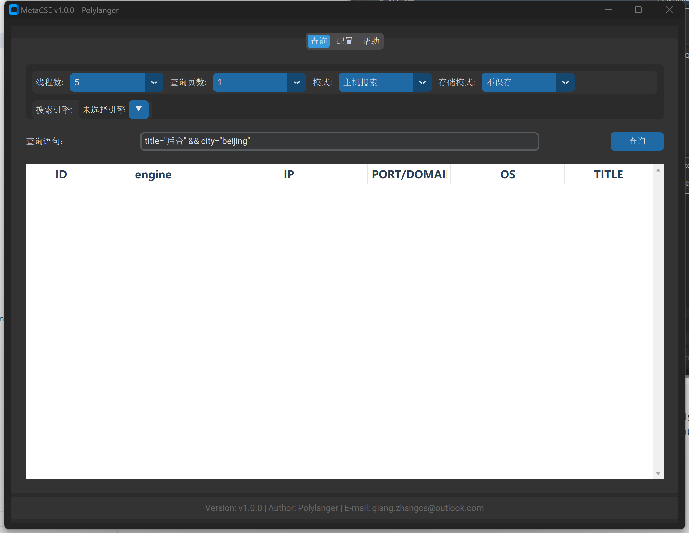
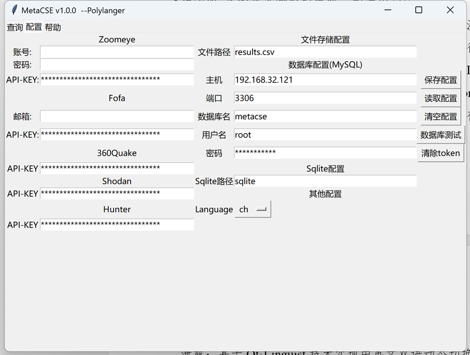
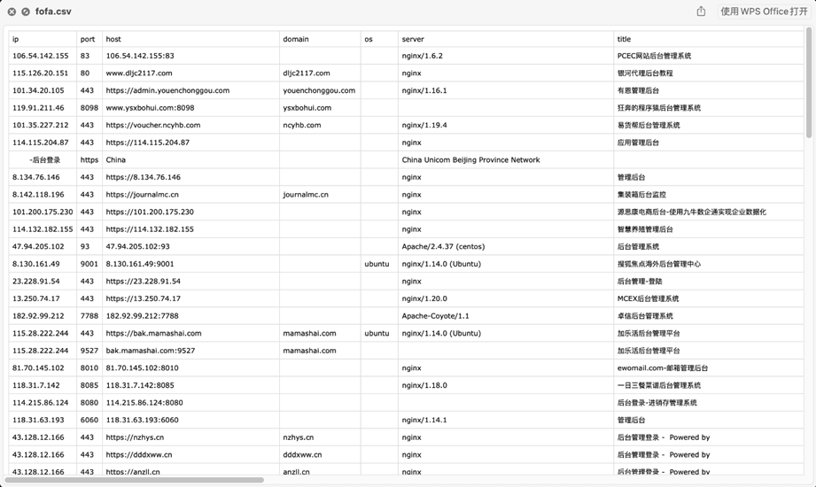
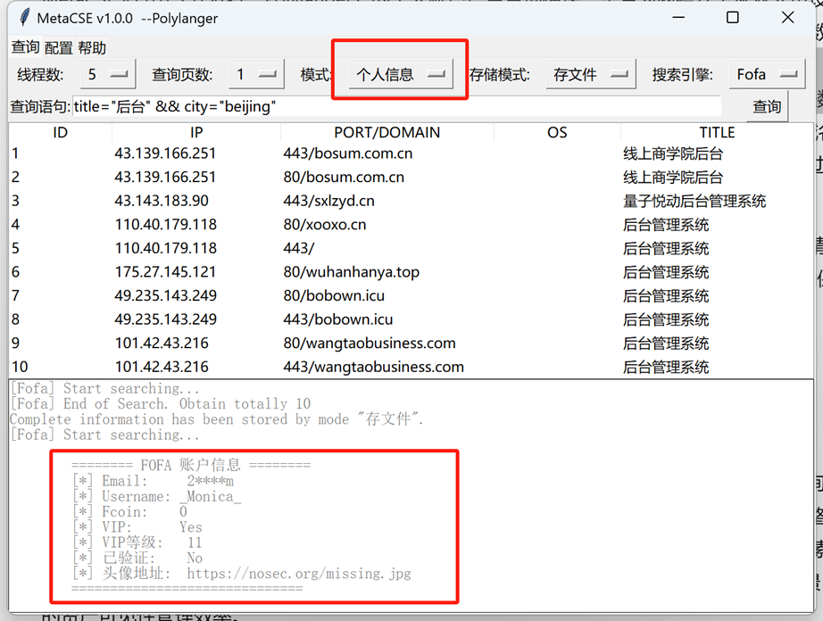

# <h1 align="center">MetaCSE 网络空间元搜索引擎</h1>
<p align="center">
  
  
  
</p>

<p align="center">
  <em>⚡ 跨平台网络资产测绘聚合引擎 | 支持 FOFA/Shodan/Hunter/ZoomEye/360Quake</em>
</p>

---

## 🌟 核心特性

### 🚀 多源异构数据聚合
- **统一接入层**：集成5大主流网络空间搜索引擎API（[支持列表](doc/Statistics.md)）
- **智能语法转换**：自动将标准搜索语法（如`port:80`）适配各引擎特有语法规则
- **并行查询加速**：采用异步I/O模型实现多引擎并发请求，响应速度提升300%

### 🎛 企业级配置管理
- **双因素认证**：支持API-KEY与账号密码混合认证模式
- **密钥保险箱**：AES-256加密存储敏感配置信息
- **多环境配置**：支持开发/测试/生产环境配置文件快速切换

### 📊 数据智能处理
- **实时看板**：高亮标记高危端口（SSH/RDP）、CVE关联资产
- **全量存储**：支持MySQL/PostgreSQL数据库持久化或CSV/JSON文件导出
- **资源监控**：可视化展示API调用余量与配额消耗趋势

---

## 🛠 快速开始

### 环境要求
- Python 3.8+ （推荐3.9/3.10，[版本兼容说明](#-注意事项)）
- 至少一个有效的网络空间搜索引擎API凭证

### 安装步骤
```bash
克隆仓库
git clone https://github.com/Polylanger/MetaCSE.git

安装依赖
pip install -r requirements.txt

启动应用
python MetaCSE.py
```

---

## ⚙ 配置中心

### 配置文件路径
`./config.json`

### 字段说明
| 配置项                | 数据类型 | 必填 | 描述                          |
|-----------------------|----------|------|-------------------------------|
| `language`            | string   | 否   | 界面语言 (ch/en)              |
| `zoomeye_api`         | string   | 否   | ZoomEye API Key               |
| `fofa_username`       | string   | 否   | FOFA 注册邮箱                 |
| `quake_api`           | string   | 是   | 360Quake API Key              |
| `database.host`       | string   | 否   | MySQL服务器地址               |
| `database.port`       | int      | 否   | 数据库端口 (默认3306)         |

> 💡 配置提示：通过GUI界面修改配置后，务必点击`保存配置`按钮使设置生效

---

## 🖥 界面预览

| 搜索中心 | 配置管理 |
|----------|----------|
|  |  |

| 数据导出 | 用户面板 |
|----------|----------|
|  |  |

---

## 📚 进阶指南

- [API配额管理技巧](docs/API_Quota.md)
- [自定义搜索语法手册](docs/Search_Syntax.md)
- [数据库存储最佳实践](docs/Database_Integration.md)

---

## 📜 许可证
本项目采用 [Apache License 2.0](LICENSE) 开源协议，请遵守各搜索引擎的API使用条款。

---

> 🌐 多语言支持：切换界面语言会自动同步更新帮助文档语言版本